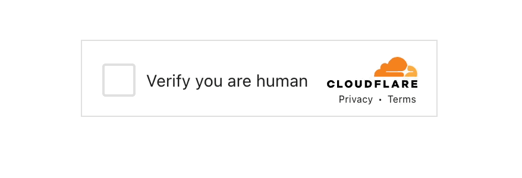

<h1 align='center'>Qwik Turnstile</h1>
<p align="center">
  
</p>

<div align='center'>
  Effortless human verification for <a href="https://qwik.dev" target="_blank">Qwik</a> apps with <a href="https://www.cloudflare.com/application-services/products/turnstile/" target="_blank">Cloudflare Turnstile</a> integration
  <br><br>

  <a href='https://img.shields.io/npm/v/qwik-turnstile?label=npm%20version'>
  
  </a>
  <a href='https://opensource.org/licenses/MIT'>
  
  </a>
  <a href='#contributors'>
  
  </a>

</div>

<!-- toc -->

- [Installation](#installation)
- [Usage](#usage)
  * [Examples](#examples)
  * [🦜 `useTurnstile()` hook](#%F0%9F%A6%9C-useturnstile-hook)
  * [✅ `verifyTurnstile()`](#%E2%9C%85-verifyturnstile)
  * [🔁 `resetTurnstile()`](#%F0%9F%94%81-resetturnstile)
- [Contributing](#contributing)
- [Code Of Conduct](#code-of-conduct)
- [Contributors](#contributors)
- [Related Links](#related-links)
- [License](#license)

<!-- tocstop -->

## Installation

```console
pnpm add qwik-turnstile
```

## Usage


### 🦜 `useTurnstile()` hook

Add this hook to your Qwik component or route.
This function returns a `Turnstile` component and a `tokenSignal` signal but also allows you to configure a callback.

```tsx
import { useTurnstile } from 'qwik-turnstile';

export default component$(() => {
    
    const { Turnstile, tokenSignal } = useTurnstile(
        {
        siteKey: import.meta.env.VITE_TURNSTILE_SITEKEY,
        onTokenResponse$: $((response) => {
            // set the value of an input field
        }),
        }
    );

});
```

### ✅ `verifyTurnstile()` 

This function is used to verify the token and returns a promise with the response.

```tsx
import { verifyTurnstile } from 'qwik-turnstile';

export const useFormAction = routeAction$(async (values, requestEvent) => {

    
    const token = values.turnstileToken;
    const secret = requestEvent.env.get("TURNSTILE_SECRET");

    const verified = await verifyTurnstile(token, secret);
    
    // you can also call `verifyTurnstile(token, secret, {debug: true})`
    // if `debug` is set to `true` it will log the response from turnstile to the console

    if (!verified) {
      console.error("Turnstile Verification Error");
      return {
        success: false
      }
    }

});
  
```

### 🔁 `resetTurnstile()`

This function is used to reset the Turnstile element on the browser / client.

Good when you want to allow multiple form submissions and reset the form each time.

```tsx
import { resetTurnstile } from 'qwik-turnstile';

export default component$(() => {
  
  useTask$(function resetTurnstileElement({ track }) {
        
    const response = track(() => action.response);
        
    if (!response.status || response.status !== "success") {
      return;
    }

    if (isServer) {
      return;
    }

    resetTurnstile();

  });

});
  
```


## Contributing

Want to contribute? Yayy! 🎉

Please read and follow our [Contributing Guidelines](CONTRIBUTING.md) to learn what are the right steps to take before contributing your time, effort and code.

Thanks 🙏

<br/>

## Code Of Conduct

Be kind to each other and please read our [code of conduct](CODE_OF_CONDUCT.md).

<br/>

## Contributors

Thanks goes to these wonderful people ([emoji key](https://allcontributors.org/docs/en/emoji-key)):

<!-- ALL-CONTRIBUTORS-LIST:START - Do not remove or modify this section -->
<!-- prettier-ignore-start -->
<!-- markdownlint-disable -->
<table>
  <tbody>
    <tr>
      <td align="center" valign="top" width="14.28%"><a href="https://hirez.io/?utm_source=github&utm_medium=link&utm_campaign=cypress-qwik"><br /><sub><b>Shai Reznik</b></sub></a><br /><a href="https://github.com/qwikifiers/cypress-qwik/commits?author=shairez" title="Code">💻</a> <a href="https://github.com/qwikifiers/cypress-qwik/commits?author=shairez" title="Tests">⚠️</a> <a href="#infra-shairez" title="Infrastructure (Hosting, Build-Tools, etc)">🚇</a> <a href="https://github.com/qwikifiers/cypress-qwik/commits?author=shairez" title="Documentation">📖</a> <a href="#maintenance-shairez" title="Maintenance">🚧</a> <a href="https://github.com/qwikifiers/cypress-qwik/pulls?q=is%3Apr+reviewed-by%3Ashairez" title="Reviewed Pull Requests">👀</a> <a href="#ideas-shairez" title="Ideas, Planning, & Feedback">🤔</a></td>
    </tr>
  </tbody>
</table>

<!-- markdownlint-restore -->
<!-- prettier-ignore-end -->

<!-- ALL-CONTRIBUTORS-LIST:END -->

This project follows the [all-contributors](https://github.com/all-contributors/all-contributors) specification. Contributions of any kind welcome!

<br/>

## Related Links 

- [Qwik Docs](https://qwik.dev/)
- [Cloudflare Turnstile Docs](https://www.cloudflare.com/application-services/products/turnstile/)
- [Qwik UI](https://qwikui.com)
- [Qwik Discord](https://qwik.dev/chat)


## License

MIT

